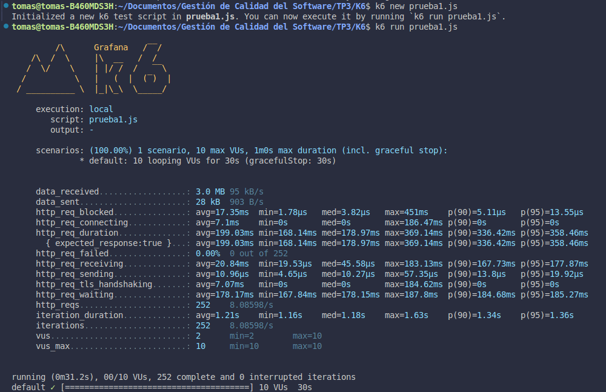
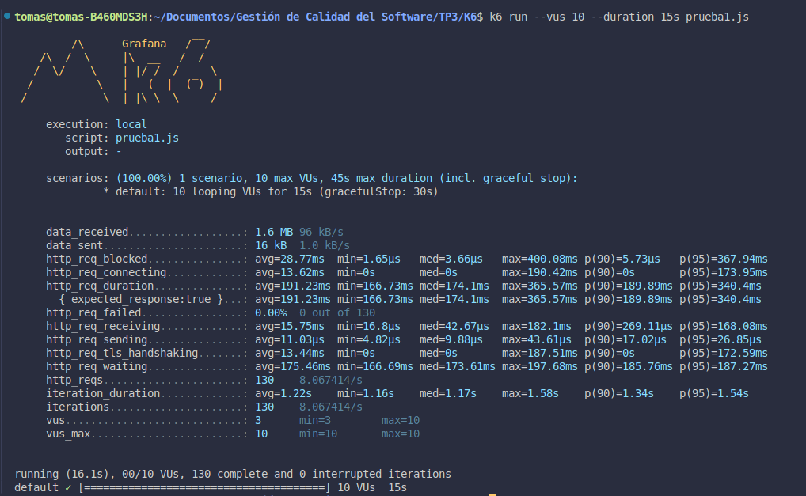
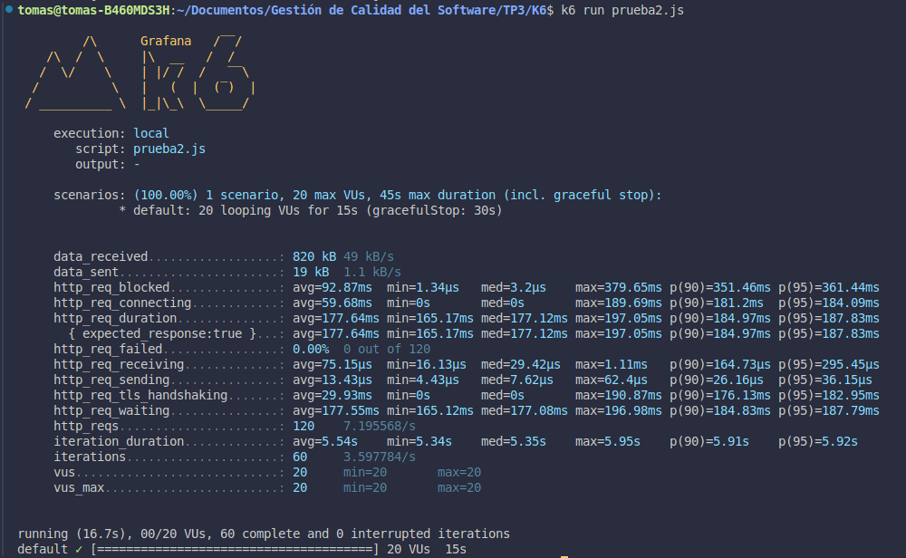
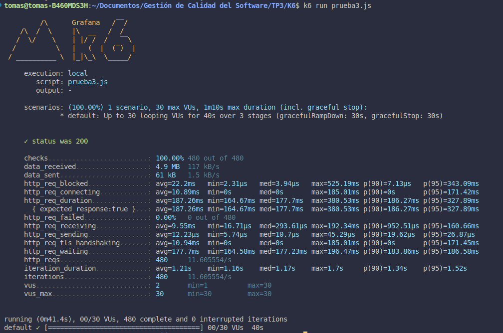

Instalación en Linux

sudo gpg -k
sudo gpg --no-default-keyring --keyring /usr/share/keyrings/k6-archive-keyring.gpg --keyserver hkp://keyserver.ubuntu.com:80 --recv-keys C5AD17C747E3415A3642D57D77C6C491D6AC1D69
echo "deb [signed-by=/usr/share/keyrings/k6-archive-keyring.gpg] https://dl.k6.io/deb stable main" | sudo tee /etc/apt/sources.list.d/k6.list
sudo apt-get update
sudo apt-get install k6

Opción 1 - Correr tests de carga manualmente con comandos

Para test local simple:
$ k6 new <nombre del archivo>.js --- Crea un script llamado <nombre del archivo>.js en el directorio actual
$ k6 run <nombre del archivo>.js --- Ejecuta el script

Para simular test de carga con mas de un usuario virtual y de cierta duracion, por consola:
$ k6 run --vus 10 --duration 30s <nombre del archivo>.js --- Corre un test de 10 usuarios virtuales con duracion de 30s

Opción 2 - Correr test automaticos con la definicion del script.js

Para un testeo de 10 usuarios y de 30s:
import http from 'k6/http';
import { sleep } from 'k6';
export const options = {
  vus: 10,
  duration: '30s',
};
export default function () {
  http.get('http://test.k6.io');
  sleep(1);
}

Luego
$ k6 run <nombre del archivo>.js --- Ejecuta el script

Opcion 3 - Correr test automaticamente con subidas y bajadas de cantidad de usuarios conectados

import http from 'k6/http';
import { check, sleep } from 'k6';

export const options = {
  stages: [
    { duration: '30s', target: 20 },
    { duration: '1m30s', target: 10 },
    { duration: '20s', target: 0 },
  ],
};

export default function () {
  const res = http.get('https://httpbin.test.k6.io/');
  check(res, { 'status was 200': (r) => r.status == 200 });
  sleep(1);
}

Luego
$ k6 run <nombre del archivo>.js --- Ejecuta el script

